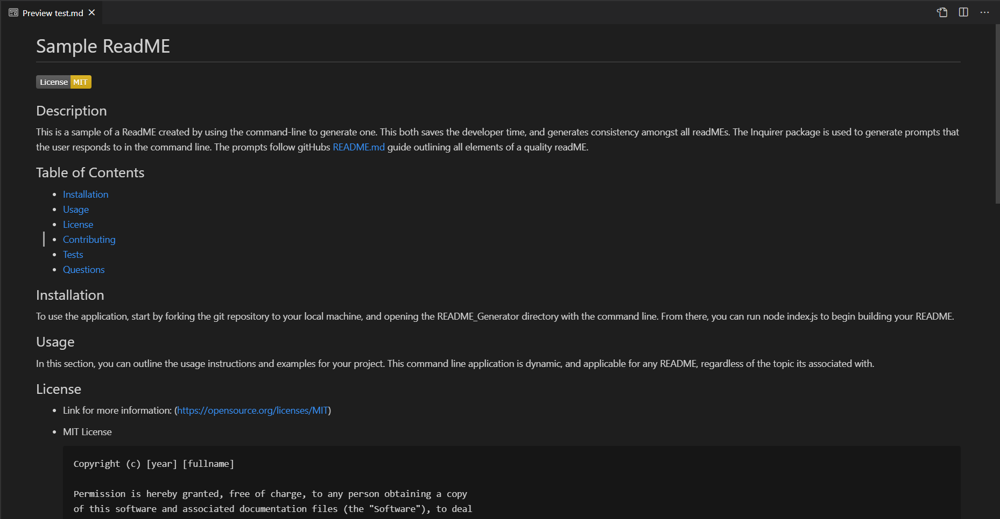

# README_Generator

## Description
Command-line application that dynamically generates a professional README.md file from a user's input. The Inquirer node package module is used to generate prompts that the user responds to in the command line. The prompts follow gitHubs README.md guide outlining all elements of a quality README.

**[Check out the video here!](https://drive.google.com/file/d/1i6kpVcWCndl1QFa8j1u-M8yVi3oyn36U/view)**

The fs node module is used to generate the README, and switch statements are utilized to generate the license badges, links, and section explanations once the user determines the license that works best for their project.

## Table of Contents
* [Usage](#usage)
* [Credits](#credits)
* [License](#license)

## Usage
* **The Finished Product**  

## Credits
Here are a few resources that helped me get this project knocked out!
* [choosealicense.com](https://choosealicense.com/)
* [README.md](https://github.com/microsoft/vscode/blob/main/README.md)
* [Markdown License Badges](https://gist.github.com/lukas-h/2a5d00690736b4c3a7ba)

## License
* Link for more information: (https://opensource.org/licenses/MIT)
* MIT License

      Copyright (c) [year] [fullname]
      
      Permission is hereby granted, free of charge, to any person obtaining a copy
      of this software and associated documentation files (the "Software"), to deal
      in the Software without restriction, including without limitation the rights
      to use, copy, modify, merge, publish, distribute, sublicense, and/or sell
      copies of the Software, and to permit persons to whom the Software is
      furnished to do so, subject to the following conditions:
      
      The above copyright notice and this permission notice shall be included in all
      copies or substantial portions of the Software.
      
      THE SOFTWARE IS PROVIDED "AS IS", WITHOUT WARRANTY OF ANY KIND, EXPRESS OR
      IMPLIED, INCLUDING BUT NOT LIMITED TO THE WARRANTIES OF MERCHANTABILITY,
      FITNESS FOR A PARTICULAR PURPOSE AND NONINFRINGEMENT. IN NO EVENT SHALL THE
      AUTHORS OR COPYRIGHT HOLDERS BE LIABLE FOR ANY CLAIM, DAMAGES OR OTHER
      LIABILITY, WHETHER IN AN ACTION OF CONTRACT, TORT OR OTHERWISE, ARISING FROM,
      OUT OF OR IN CONNECTION WITH THE SOFTWARE OR THE USE OR OTHER DEALINGS IN THE
      SOFTWARE.
